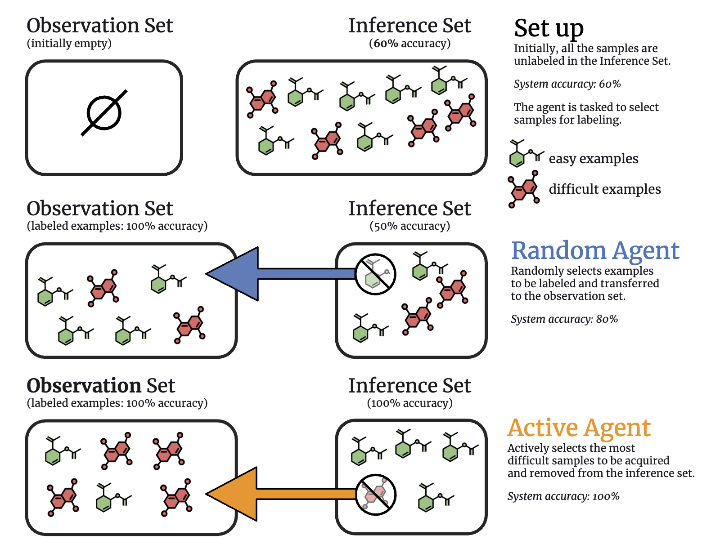

# Efficient Biological Data Acquisition through Inference Set Design

This is the code for the paper ["Efficient Biological Data Acquisition through Inference Set Design"](https://arxiv.org/abs/2410.19631) accepted at ICLR 2025. 

### Overview

In drug discovery, highly automated high-throughput laboratories are used to screen a large number of compounds in search of effective drugs. These experiments are expensive, so one might hope to reduce their cost by experimenting on a subset of the compounds, and predicting the outcomes of the remaining experiments. In this work, we model this scenario as a sequential subset selection problem: we aim to select the smallest set of candidates in order to achieve some desired level of accuracy for the system as a whole. Our key observation is that, if there is heterogeneity in the difficulty of the prediction problem across the input space, selectively obtaining the labels for the hardest examples in the acquisition pool will leave only the relatively easy examples to remain in the inference set, leading to better overall system performance. We call this mechanism _inference set design_, and propose the use of a confidence-based active learning solution to prune out these challenging examples. Our algorithm includes an explicit stopping criterion that stops running the experiments when it is sufficiently confident that the system has reached the target performance. Our empirical studies on image and molecular datasets, as well as a real-world large-scale biological assay, show that active learning for inference set design leads to significant reduction in experimental cost while retaining high system performance.
<p align="center">

</p>
### Installation

```
pip install -r requirements.txt
pip install -e .
```

### Training a model

To train a model, simply run the `main.py`, and edit the configuration defined in the script to run a particular experiment. The configuration is self-documented in the `config.py` file. You can find tutorials on how to train models and visualize results in `notebooks/tutorials`. 

### Citation

If you use this code in your research, please cite the following paper:

```
@misc{neporozhnii2024efficientbiologicaldataacquisition,
      title={Efficient Biological Data Acquisition through Inference Set Design}, 
      author={Ihor Neporozhnii and Julien Roy and Emmanuel Bengio and Jason Hartford},
      year={2024},
      eprint={2410.19631},
      archivePrefix={arXiv},
      primaryClass={cs.LG},
      url={https://arxiv.org/abs/2410.19631}, 
}
```
